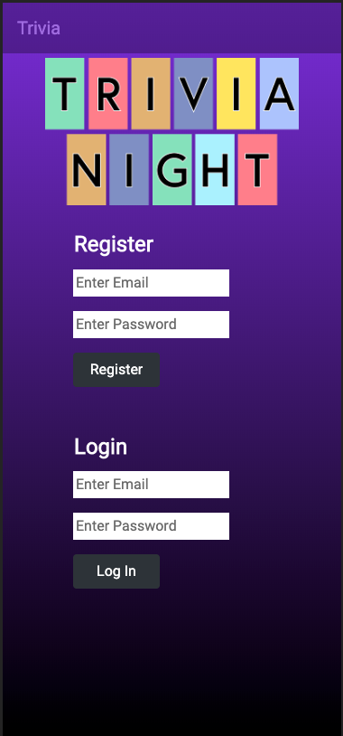
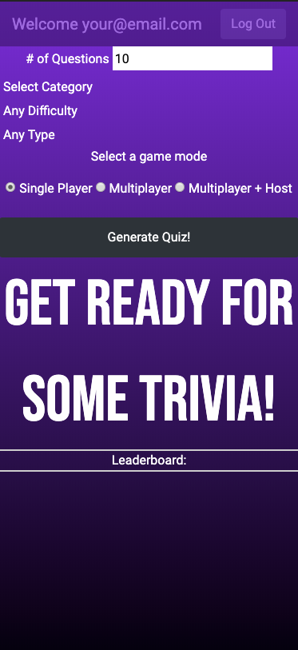
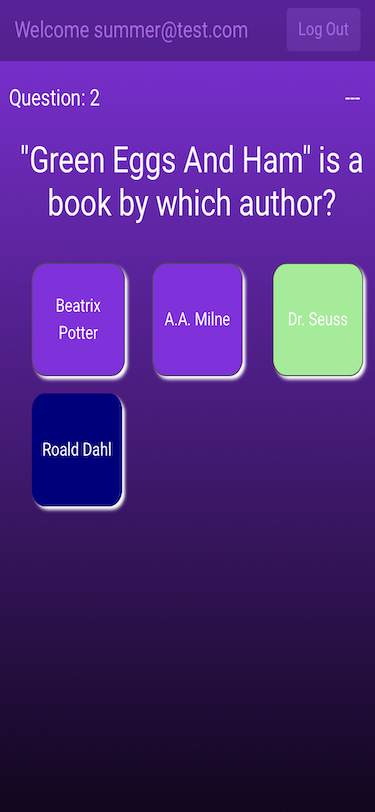

# Trivia App

This application provides users with trivia questions with the users choice of category, difficulty, and number of questions. Provides single and multi play mode.

This applications uses Google Firebase

Application API: https://opentdb.com

## Authors

    Summer Brown
    Rawand Dargali
    Dan Ochs
    Ian Sear

## Single player mobile overview

#### Fourth screenshot links to video

Multi-player usability in beta

DigitalCrafts November 2019 Cohort
UI Project
